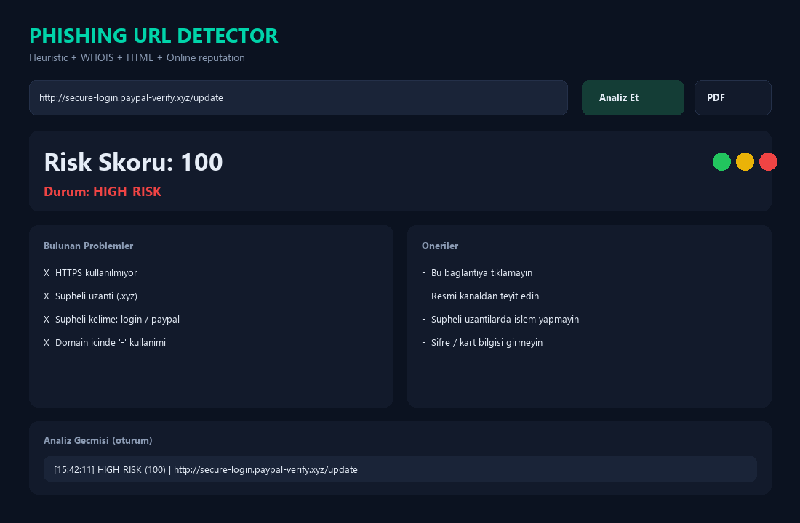

# Phishing URL Detector

A modular Python tool that analyzes URLs with heuristic rules and WHOIS-based reputation signals, then produces a risk score, clear findings, and actionable recommendations.

Built for real-world defensive security workflows and as a clean portfolio project (PEP 8, type hints, tests, extensible report layer).

---

## Features

- **URL validation** and normalization
- **Heuristic checks**
  - HTTPS usage
  - Domain / URL length
  - Subdomain count
  - IP-based hosts
  - `@` userinfo tricks
  - `//` path obfuscation
  - Hyphenated domains
  - Digit density
  - Suspicious TLDs (`.xyz`, `.top`, `.click`, `.ru`, `.tk`, `.gq`, `.ml`, `.cf`)
  - Phishing keywords (`login`, `verify`, `secure`, `account`, `update`, `bank`, `paypal`, `crypto`, …)
- **Reputation checks** via WHOIS (domain age; graceful fallback if lookup fails)
- **HTML content checks** via `requests` + BeautifulSoup
  - password fields
  - forms posting to external domains
  - iframe usage
  - graceful handling when the page cannot be fetched
- **Risk scoring**
  - `0–20` → SAFE
  - `21–50` → SUSPICIOUS
  - `51–100` → HIGH RISK
- **Dark cyber-themed Tkinter GUI** (green / yellow / red status colors)
- **JSON and PDF reports** (shared `ReportWriter` interface)
- **Batch analysis** from TXT/CSV files (`--batch`)
- **Structured logging**
- **Unit tests** with mocked network calls

---

## Project Structure

```text
phishing-url-detector/
├── main.py                 # Application entrypoint
├── config.py               # Scores, thresholds, keyword/TLD lists
├── requirements.txt
├── detector/
│   ├── analyzer.py         # Orchestrates analysis
│   ├── heuristics.py       # URL shape / pattern rules
│   ├── reputation.py       # WHOIS / domain age
│   ├── content.py          # HTML content signals
│   ├── batch.py            # Bulk TXT/CSV analysis
│   └── report.py           # JSON/PDF report writers
├── gui/
│   ├── app.py              # Tkinter dark UI
│   └── history.py          # In-session analysis history
├── samples/                # Example URL lists for batch mode
├── utils/
│   ├── helpers.py          # Parsing helpers
│   └── logger.py           # Shared logging setup
├── reports/                # Generated JSON reports
└── tests/                  # Unit tests
```

---

## Requirements

- Python **3.11+** (3.12+ recommended)
- Dependencies listed in `requirements.txt`

---

## Installation

```bash
git clone https://github.com/Dryhawell/phishing-url-detector.git
cd phishing-url-detector
python -m venv .venv

# Windows
.venv\Scripts\activate

# macOS / Linux
source .venv/bin/activate

pip install -r requirements.txt
```

### Editable / package install

```bash
pip install -e .
# or with test + packaging tools:
pip install -e ".[dev]"
```

After install you can also launch:

```bash
phishing-url-detector
```

---

## Packaging

### Wheel / sdist

```bash
pip install -r requirements-dev.txt
python -m build
```

Artifacts appear under `dist/`.

### Windows `.exe` (PyInstaller)

```bash
pip install -r requirements-dev.txt
python scripts/build_exe.py
```

Output: `dist/PhishingURLDetector.exe` (windowed, one-file).  
First build can take several minutes and the binary is large because it bundles Python + dependencies.

---

## Usage

### GUI

```bash
python main.py
```

1. Paste a URL into the input field  
2. Click **Analiz Et** (or press Enter)  
3. Review **Risk Skoru**, **Durum**, problems, and recommendations  
4. Optionally click **JSON Kaydet** or **PDF Kaydet** to export under `reports/`

### Batch mode (TXT / CSV)

```bash
python main.py --batch samples/urls.txt
python main.py --batch samples/urls.csv --output reports/my_batch.json
```

- `.txt`: one URL per line (`#` comments allowed)
- `.csv`: reads the `url` column by default (`--csv-column` to override)
- Writes a summary JSON with SAFE / SUSPICIOUS / HIGH_RISK / INVALID counts
- Each item includes a short `url_hash` (SHA-256 fingerprint)

### Programmatic (quick check)

```python
from detector.analyzer import analyze_url
from detector.report import save_json_report

result = analyze_url("http://secure-login.paypal-verify.xyz/update")
print(result.risk_score, result.risk_level)
print(result.problems)
save_json_report(result)
```

### Tests

```bash
python -m pytest tests -v
```

---

## Example Output

```text
Risk Skoru : 82
Durum      : HIGH_RISK

Nedenler
❌ HTTPS kullanılmıyor
❌ Şüpheli uzantı (.xyz)
❌ Şüpheli kelime bulundu: 'login'
❌ IP adresi kullanılmış
```

---

## Screenshot

Capture the GUI after a high-risk analysis and save it as:

`docs/screenshot.png`

Then it will render below:



If the image is not uploaded yet, GitHub will show a broken-image placeholder until you add the file.

---

## Configuration

Tune scoring and thresholds in `config.py` without touching core logic:

- `RISK_SCORES`
- `SUSPICIOUS_TLDS`
- `PHISHING_KEYWORDS`
- `NEW_DOMAIN_DAYS`
- length / subdomain / digit thresholds

---

## Roadmap / Future Plans

- [x] PDF report export (`PdfReportWriter`)
- [x] Batch URL analysis (CSV/TXT input)
- [x] Richer GUI history panel (session)
- [x] Packaging (`pip install -e .` / PyInstaller exe helper)
- [ ] Optional online reputation APIs (Safe Browsing / community blocklists)
- [ ] Browser extension companion

---

## Disclaimer

This tool provides **heuristic assistance**, not a guarantee. Always verify sensitive links through official channels. Do not use it to attack systems or bypass security controls.

---

## License

MIT © Talha Tarlabaz
